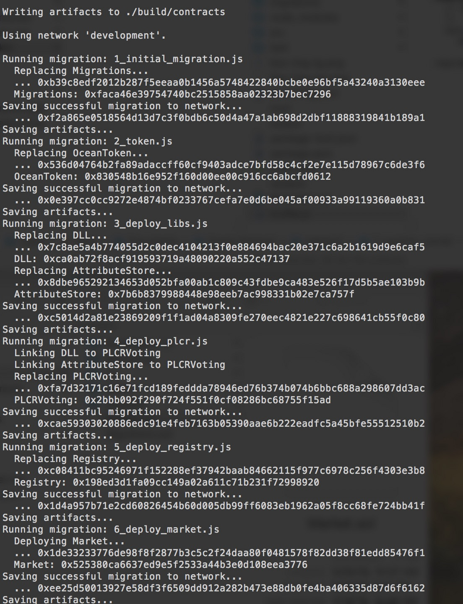

[](https://oceanprotocol.com)

> 💧 Integration of TCRs, CPM and Ocean Tokens
> [oceanprotocol.com](https://oceanprotocol.com)

[](https://travis-ci.com/oceanprotocol/plankton-keeper)

Ocean Keeper implementation where we put the following modules together:

* **TCRs**: users create challenges and resolve them through voting to maintain registries;
* **Ocean Tokens**: the intrinsic tokens circulated inside Ocean network, which is used in the voting of TCRs;
* **Curated Proofs Market**: the core marketplace where people can transact with each other and curate assets through staking with Ocean tokens.


## Usage

Use `$ npm install` to download all the required libraries

Use `$ truffle compile` to compile those solidity files:


Then deploy them into testRPC `$ truffle migrate`:



Note:

* there are `Error: run out of gas` because we try to deploy so many contracts as one single transaction. Tune the `gas` value in `truffle.js` file to make them run through.
* we enable the solc optimizer to reduce the gas cost of deployment. It can now be deployed with less gas limit such as "gas = 5000000"
* no need to update the "from : 0x3424ft..." in `truffle.js` and it will use the first account in testRPC or ganache-cli by default.

Test them with `$ truffle test test/registry.js`:


## Public Interfaces

The following project exposes the following public interfaces:

### Curation Market

```solidity
//Allows a user to start an application. Takes tokens from user and sets apply stage end time.
function apply(bytes32 _listingHash, uint _amount, string _data);

// Allows the owner of a listingHash to increase their unstaked deposit.
function deposit(bytes32 _listingHash, uint _amount);

## Table of Contents

  - [Get Started](#get-started)
  - [Testing](#testing)
  - [Documentation](#documentation)
  - [Contributing](#contributing)
  - [License](#license)

---

## Get Started

As a pre-requisite, you need Node.js >= v6.11.5.

Clone the project and install all dependencies:

```bash
git clone git@github.com:oceanprotocol/plankton-keeper.git
cd plankton-keeper/

# install dependencies
npm i

# install RPC client globally
npm install -g ganache-cli
```

### Marketplace

Compile the solidity contracts:

```bash
truffle compile
```

### Query functions

```solidity

// Return the number of drops associated to the message.sender to an Asset 
function dropsBalance(uint256 assetId) public view returns (uint256);

// Return true or false if an Asset is active given the assetId
function checkAsset(uint256 assetId) public view returns (bool);

// Get the url attribute associated to a given the assetId
function getAssetUrl(uint256 assetId) public view returns (bytes32);

In a new terminal, launch an Ethereum RPC client, e.g. [ganache-cli](https://github.com/trufflesuite/ganache-cli):

```bash
ganache-cli
```

Switch back to your other terminal and deploy the contracts:

```bash
truffle migrate

# for redeployment run this instead
truffle migrate --reset
```

Note:
* there are `Error: run out of gas` because we try to deploy so many contracts as one single transaction. Tune the `gas` value in `truffle.js` file to make them run through.
* we enable the solc optimizer to reduce the gas cost of deployment. It can now be deployed with less gas limit such as `gas = 5000000`
* no need to update the `from : 0x3424ft...` in `truffle.js` and it will use the first account in testRPC or ganache-cli by default.

## Testing

Run tests with `truffle test`, e.g.:

```bash
truffle test test/registry.js
```

## Documentation

* [**Main Documentation: TCR and CPM and Ocean Tokens**](doc/)
* [Architecture](doc/files/Smart-Contract-UML-class-diagram.pdf)

## Contributing

Plankton Keeper uses GitHub as a means for maintaining and tracking issues and source code development.

If you would like to contribute, please fork this code, fix the issue then commit, finally send a pull request to maintainers in order to review your changes. 

Ocean Protocol uses [C4 Standard process](https://github.com/unprotocols/rfc/blob/master/1/README.md) to manage changes in the source code.  Find here more details about [Ocean C4 OEP](https://github.com/oceanprotocol/OEPs/tree/master/1).

## License

```
Copyright 2018 Ocean Protocol Foundation

Licensed under the Apache License, Version 2.0 (the "License");
you may not use this file except in compliance with the License.
You may obtain a copy of the License at

   http://www.apache.org/licenses/LICENSE-2.0

Unless required by applicable law or agreed to in writing, software
distributed under the License is distributed on an "AS IS" BASIS,
WITHOUT WARRANTIES OR CONDITIONS OF ANY KIND, either express or implied.
See the License for the specific language governing permissions and
limitations under the License.
```
