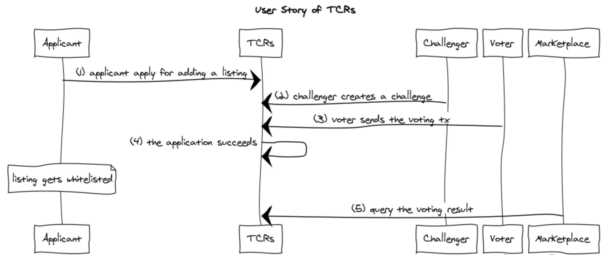
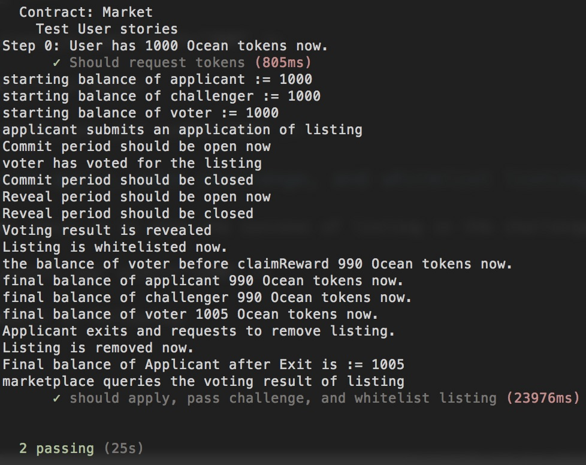

# POC: Integration of TCRs, CPM and Ocean Tokens with Solidity

```
name: Demo a prototype integration of TCRs, CPM, and Ocean tokens with Solidity
type: development
status: initial draft
editor: Fang Gong <fang@oceanprotocol.com>
date: 06/01/2018
```

## 1. Objective

In this POC, we put following modules together:

* **TCRs**: users create challenges and resolve them through voting to maintain registries;
* **Ocean Tokens**: the intrinstic tokens circulated inside Ocean network, which is used in the voting of TCRs;
* **Curated Proofs Market**: the core marketplace where people can transact with each other and curate assets through staking with Ocean tokens.


## 2. File Structure
There are several folders and each includes solidity source files for each module:


* **bondingCurve**: it caculates the bonding curve values when users purchase drops or sell drops in the marketplace;
* **plcrvoting**: Partial Lock Commit Reveal Voting System;
* **tcr**: the TCRs related files;
* **token**: Ocean tokens based on ERC20 standard;
* **zeppelin**: the library files from OpenZeppelin;
* **market.sol**: curated proofs market (*on-going work*)

## 2. Architecture of Modules

The dependency between different modules are illustrated as below:


* Marketplace (Market.sol) sends listing hash to TCRs (Registry.sol) so that to create challenges.
* Users can use Ocean Tokens (OceanToken.sol) to vote for or against (PLCRVoting.sol).
* Voting is configured with the parameters (Parameterizer.sol).
* Marketplace uses bonding curve (BancorFormula.sol) to determine the price of drops.
* BancorFormula calculates the power function (Power.sol).
* TCRs (Registry.sol) send the voting result back to Marketplace (Market.sol).


## 3. Compile, Migrate and Test

Use `$ truffle compile` to compile those solidity files:


Then deploy them into testRPC `$ truffle migrate`:


Note there are `Error: run out of gas` because we try to deploy so many contracts as one single transaction. Tune the `gas` value in `truffle.js` file to make them run through.

Test them with `$ truffle test test/registry.js`:


## 3. User Stories

### 3.1 Should apply, fail challenge, and reject listing

The first user story is to show the failure of listing in the challenge with TCRs.


The JS testing code is:


 
The testing result is below:
  


### 3.2 Should apply, pass challenge, and whitelist listing

The second user story is to show the success of listing in the challenge with TCRs.



The testing result is following:



Note that:

* Applicant wins the voting but he cannot access the reward tokens + deposit before he exits
	* Applicant initial fund = 1000 
	* Pays 10 tokens for application, and balance = 990
	* After voting is revealed, applicant wins but have no access to these tokens
	* When applicant exits and removes listing, he receives the rewards and deposit and total is 1005 (half of the deposit from challenger)
* 	Voter has 1000 tokens as initial fund:
	*  Pays 10 tokens to vote in the challenge and wins the voting
	*  Voter receives the reward of 5 tokens (half of challenger 10 token deposit)
	*  Voter has access to these tokens after he claims the reward
	*  Final balance is 1005 (initial 1000 tokens + 5 token reward)
* Challenger has initial 1000 tokens:
	* Pay 10 tokens to challenge the listing
	* Lose the voting and his 10 tokens is slashed
	* Voters and Applicants split Challenger's token deposit
	* Final balance of challenger is 990
