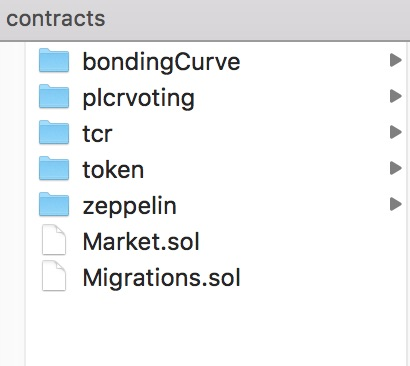
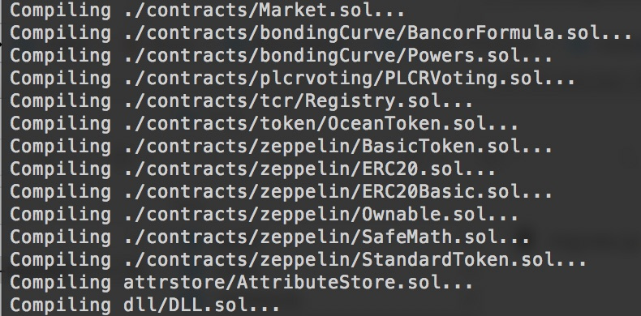
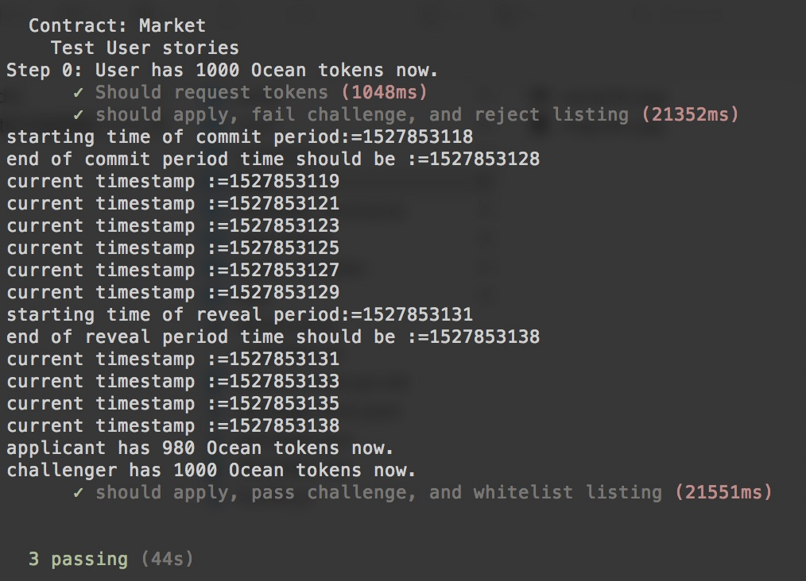

# POC: Integration of TCRs, CPM and Ocean Tokens with Solidity

```
name: Demo a prototype integration of TCRs, CPM, and Ocean tokens with Solidity
type: development
status: initial draft
editor: Fang Gong <fang@oceanprotocol.com>
date: 06/01/2018
```

## 1. Objective

In this POC, we put following modules together:

* **TCRs**: users create challenges and resolve them through voting to maintain registries;
* **Ocean Tokens**: the intrinstic tokens circulated inside Ocean network, which is used in the voting of TCRs;
* **Curated Proofs Market**: the core marketplace where people can transact with each other and curate assets through staking with Ocean tokens.


## 2. Public Interface

The following project exposes the following public interfaces:

### 2.1 Curation Market

```solidity
//Allows a user to start an application. Takes tokens from user and sets apply stage end time.
function apply(bytes32 _listingHash, uint _amount, string _data);

// Allows the owner of a listingHash to increase their unstaked deposit.
function deposit(bytes32 _listingHash, uint _amount);

//Allows the owner of a listingHash to decrease their unstaked deposit.
function withdraw(bytes32 _listingHash, uint _amount);

// Allows the owner of a listingHash to remove the listingHash from the whitelist
function exit(bytes32 _listingHash);

// Starts a poll for a listingHash which is either in the apply stage or already in the whitelist. 
function challenge(bytes32 _listingHash, string _data);

// Updates a listingHash’s status from ‘application’ to ‘listing’ or resolves a challenge if one exists.
function updateStatus(bytes32 _listingHash);

// Called by a voter to claim their reward for each completed vote.
function claimReward(uint _challengeID, uint _salt);

// Calculates the provided voter’s token reward for the given poll.
function voterReward(address _voter, uint _challengeID, uint _salt);

// Determines whether the given listingHash be whitelisted.
function canBeWhitelisted(bytes32 _listingHash);

// Returns true if the provided listingHash is whitelisted
function isWhitelisted(bytes32 _listingHash);

// Determines the number of tokens awarded to the winning party in a challenge.
   function determineReward(uint _challengeID);
```

### 2.2 Marketplace

```solidity
// Register provider and assets （upload by changing uploadBits）
function register(uint256 assetId) public returns (bool success);

// publish consumption information about an Asset
function publish(uint256 assetId, bytes32 url, bytes32 token) external returns (bool success);

// purchase an asset and get the consumption information
function purchase(uint256 assetId) external returns (bytes32 url, bytes32 token);

// Return the list of available assets
function listAssets() external view returns (uint256[50]); 
```

### 2.3 Events

#### Marketplace

```solidity
event AssetRegistered(uint256 indexed _assetId, address indexed _owner);
event AssetPublished(uint256 indexed _assetId, address indexed _owner);
event AssetPurchased(uint256 indexed _assetId, address indexed _owner);
```

## 3. File Structure
There are several folders and each includes solidity source files for each module:



* **bondingCurve**: it caculates the bonding curve values when users purchase drops or sell drops in the marketplace;
* **plcrvoting**: Partial Lock Commit Reveal Voting System;
* **tcr**: the TCRs related files;
* **token**: Ocean tokens based on ERC20 standard;
* **zeppelin**: the library files from OpenZeppelin;
* **market.sol**: curated proofs market (*on-going work*)

## 4. Architecture of Modules

The dependency between different modules are illustrated as below:


* Marketplace (Market.sol) sends listing hash to TCRs (Registry.sol) so that to create challenges.
* Users can use Ocean Tokens (OceanToken.sol) to vote for or against (PLCRVoting.sol).
* Voting is configured with the parameters (Parameterizer.sol).
* Marketplace uses bonding curve (BancorFormula.sol) to determine the price of drops.
* BancorFormula calculates the power function (Power.sol).
* TCRs (Registry.sol) send the voting result back to Marketplace (Market.sol).

## 5. Architecture of solidity Market contract

<a href="Smart contract UML class diagram.pdf">First draft of UML class diagram</a>

## 6. Compile, Migrate and Test

Use `$ truffle compile` to compile those solidity files:



Then deploy them into testRPC `$ truffle migrate`:


Note there are `Error: run out of gas` because we try to deploy so many contracts as one single transaction. Tune the `gas` value in `truffle.js` file to make them run through.

Test them with `$ truffle test test/registry.js`:




