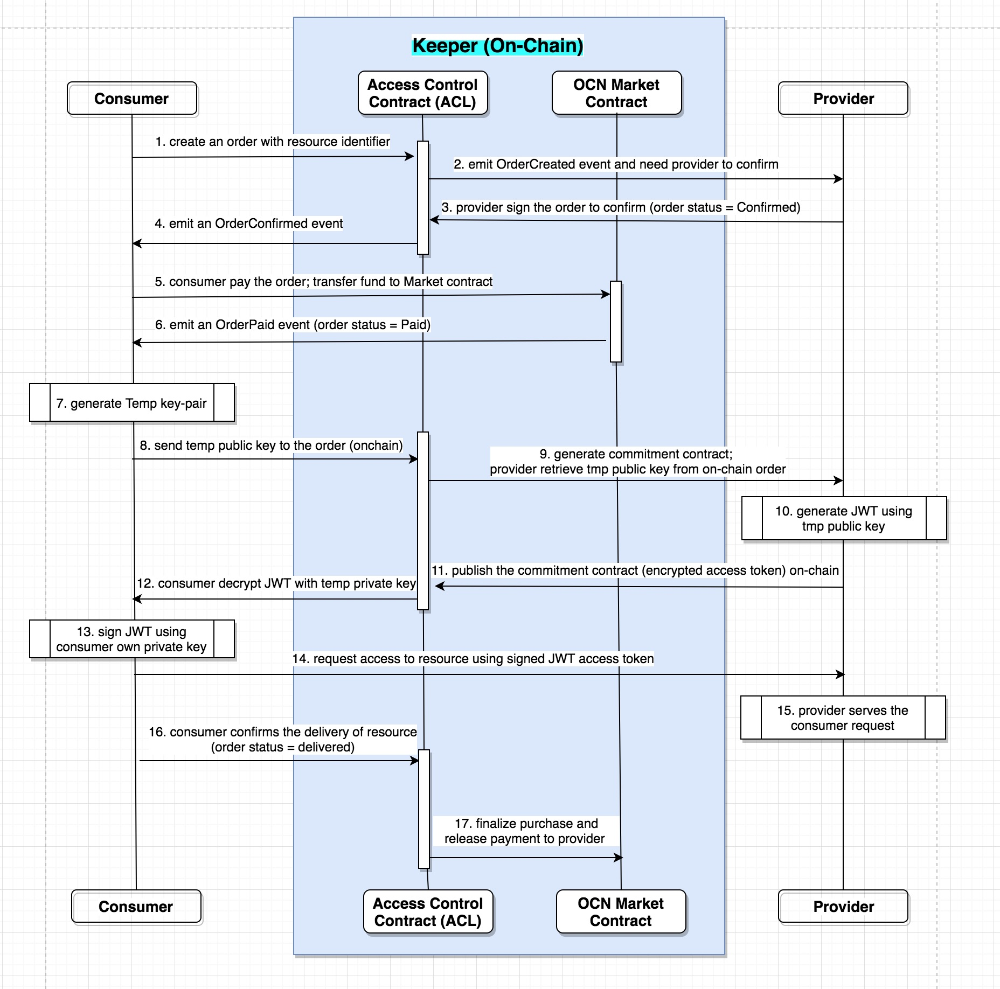
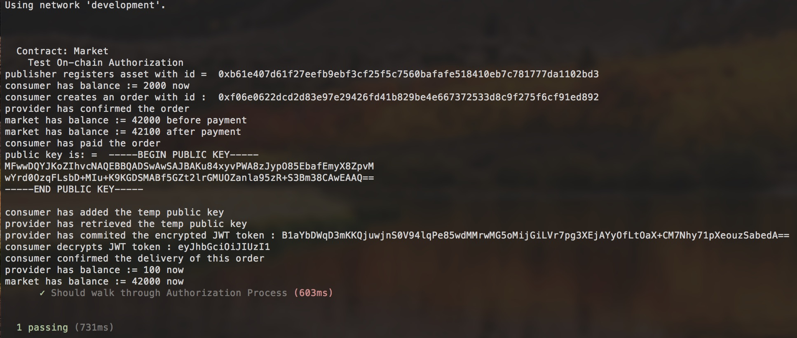

# Authorization Implementation Manual

```
name: Implementation Manual of On-chain Authorization with Solidity
type: development
status: initial draft
editor: Fang Gong <fang@oceanprotocol.com>
contributors: Ahmed Ali <ahmed@oceanprotocol.com>, 
              Samer Sallam <samer@oceanprotocol.com>,
              Aitor Argomaniz <aitor@oceanprotocol.com>
date: 07/13/2018
```

The on-chain authorization proposal can be found in [OEP-10](https://github.com/oceanprotocol/OEPs/tree/feature/OEP-3_On_chain_Auth/10).

This document introduces some implementation details.

## 1. Access Control Flow

The flow chart is illustrated as following:



It includes below steps to authorize a consumer to access the resource from the provider:

1. Consumer creates an order with resource indentifier;
2. ACL contract notices the provider to confirm the order;
3. provider confirms the order in ACL contract (order status is updated as "confirmed");
4. ACL contract notices the consumer that the order has been confirmed;
5. Consumer pays the order and transfer funds to the Market contract (order status is updated as "paid");
6. Market contract emit an event to notice consumer that the payment is transferred successfully;
7. Consumer generates temporary key pairs including temp public key and temp private key.
8. Consumer sends the temp public key to the order in ACL contract;
9. Provider retrieves the temp public key from the order in ACL contract;
10. Provider generates the JWT and ecrypts it using the temp public key;
11. Provider sends the encrypted JWT to the order in ACL contract;
12. Consumer retrieves the encrypted JWT and decrypts it using temp private key;
13. Consumer signs the JWT using private key of his/her own account (i.e., private key of wallet account);
14. Consumer sends the signed JWT to provider and request access of resource;
15. Provider verifies consumer's signature using consumer's wallet public key and serves the access request; 
16. Consumer confirms the delivery of the resource in the order (order status is updated as "delivered");
17. ACL contract interacts with Market contract to releases the consumer's payment to provider. 


## 2. Data Structure 

To track the status of authorization, an `Order` struct is created and maintained inside ACL contract.


It includes following members:

- resourceId: the resource identifier (bytes32);
- provider: the public address of provider for this resource;
- consumer: the public address of consumer for this resource;
- delivered: the resource is delivered or not (boolean; only consumer can update);
- paid: the order is paid or not (boolean; only the Market contract can update);
- confirmed: the order is confirmed by provider or not (boolean; only provider can update);
- tmpPubKey: the temporary public key generated by consumer (string);
- token: the encrypted JWT (i.e., access token of resource) generated by provider (string).


A global mapping `mOrders` is maintained to associate the OrderId to corresponding Order struct which includes necessary information of an order.

## 3. Testing Use Story

The related testing file is `test/TestACL.js`. It implements beow testing:

1. consumer initially has 2000 Ocean tokens;
2. consumer creates an order trying to purchase resource;
3. provider confirms the order by updating `bool confirmed = true` in the order;
4. consumer makes the payment of 100 Ocean tokens:
	* consumer transfers 100 Ocean tokens to the Market contract;
	* Market contract updates the order status `bool paid = true`; 
	* Market contract has 100 more tokens and balance becomes 42100 Ocean tokens;
5. consumer adds the temp public key to the order stored on-chain;
6. provider retrieves the temp public key from on-chain order;
7. provider generates JWT and encrypt it with temp public key;
8. provider adds the encrypted JWT to the order stored on-chain;
9. consumer retrieves the encrypted JWT and decrypt using temp private key;
10. consumer confirms the delivery of resource by updating `bool delivered = true`;
11. ACL contract asks Market contract to release the consumer's payment to provider
	* provider has 100 Ocean tokens paid by consumer now;
	* Market contract transfer 100 Ocean tokens to provider, therefore, its account balance is reduced by 100 tokens.  

